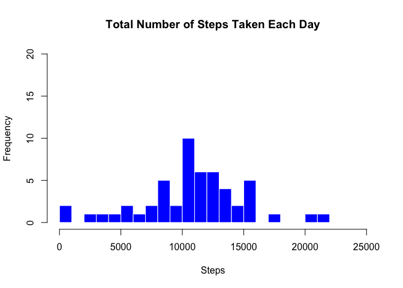
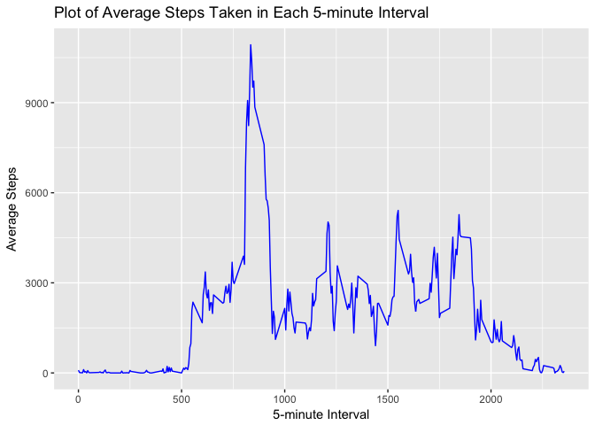
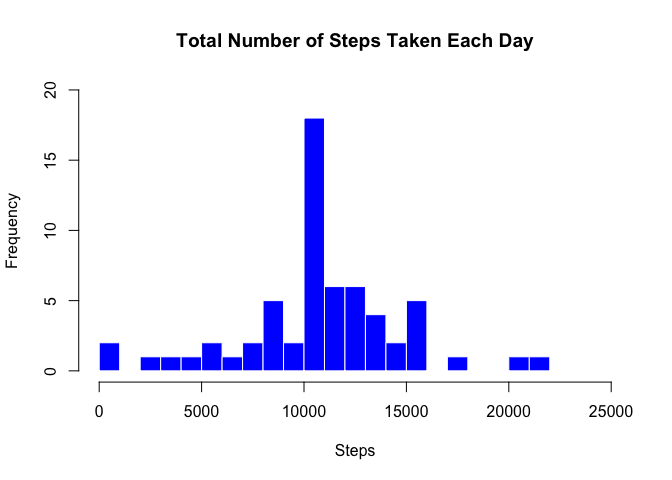
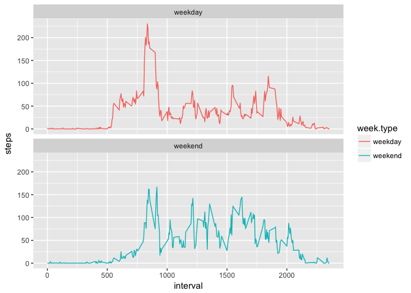

# Reproducible Research: Peer Assessment 1


## Loading and preprocessing the data

```r
data <- read.csv("activity.csv", header= TRUE, colClasses=c("numeric", "character", "integer"))
data$date <- as.Date(data$date, format = "%Y-%m-%d")
str(data)
```

```
## 'data.frame':	17568 obs. of  3 variables:
##  $ steps   : num  NA NA NA NA NA NA NA NA NA NA ...
##  $ date    : Date, format: "2012-10-01" "2012-10-01" ...
##  $ interval: int  0 5 10 15 20 25 30 35 40 45 ...
```

## What is mean total number of steps taken per day?
###1.Calculate the total number of steps taken per day
###2. Make a histogram of the total number of steps taken each day.

```r
#Calculate the total number of steps taken each day
total.steps <- aggregate(data$steps, by=list(data$date), sum, siplify=TRUE)
names(total.steps) <- c('date', 'steps')

#Plot a histogram
par(mfrow = c(1, 1))
hist(total.steps$steps, breaks = 20, main = "Total Number of Steps Taken Each Day", col = "blue", border = "white", xlab = "Steps", ylab="Frequency", xlim=c(0,25000),ylim=c(0,8))
```

 
###3. Calculate and report the mean and median of the total number of steps taken per day.

```r
#mean of total number of steps taken per day
mean(total.steps$steps, na.rm=TRUE) 
```

```
## [1] 10767.19
```

```r
#median of total number of steps taken per day
median(total.steps$steps, na.rm=TRUE) 
```

```
## [1] 10766
```
## What is the average daily activity pattern?

```r
#Calculate the average number of steps taken in each 5-minute interval per day 
avg.interval<-aggregate(data$steps, by=list(data$interval), sum, simplify=T, na.rm=TRUE)
names(avg.interval) <- c('interval', 'avg.steps')

#Plot the line graph
library(ggplot2)
ggplot(avg.interval, aes(x=interval, y=avg.steps)) + geom_line(colour="blue") + labs(title = "Plot of Average Steps Taken in Each 5-minute Interval", x = "5-minute Interval", y = "Average Steps")
```
 
```r
#Which 5-minute interval, on average across all the days in the dataset, contains the maximum number of steps?
avg.interval[which.max(avg.interval$avg.steps),]
```

```
##     interval avg.steps
## 104      835     10927
```
The 835th 5-minute interval has the maximum number of steps across all days. 

## Imputing missing values

```r
#Calculate total number of missing values (NA) in the dataset
sum(is.na(data$steps))
```

```
## [1] 2304
```

```r
#Fill NA's with average for that 5-min interval
# Create a new dataset (named as "data.full") that is equal to the original dataset but with the missing data filled in
data.full <- data
nas <- is.na(data.full$steps)
interval.avg <- tapply(data.full$steps, data.full$interval, mean, na.rm=TRUE, simplify=TRUE)
data.full$steps[nas] <- interval.avg[as.factor(data.full$interval[nas])]

#Calculate the total number of steps taken each day
total.steps.full <- aggregate(data.full$steps, by=list(data.full$date), sum, siplify=TRUE)
names(total.steps.full) <- c('date', 'steps')

#Plot a histogram
par(mfrow = c(1, 1))
hist(total.steps.full$steps, breaks = 20, main = "Total Number of Steps Taken Each Day", col = "blue", border = "white", xlab = "Steps", ylab="Frequency", xlim=c(0,25000),ylim=c(0,8))
```
 
```r
#mean of total number of steps taken per day
mean(total.steps.full$steps, na.rm=TRUE) 
```

```
## [1] 10767.19
```

```r
#median of total number of steps taken per day
median(total.steps.full$steps, na.rm=TRUE) 
```

```
## [1] 10767.19
```

## Are there differences in activity patterns between weekdays and weekends?

```r
library(dplyr)
```

```
## 
## Attaching package: 'dplyr'
```

```
## The following objects are masked from 'package:stats':
## 
##     filter, lag
```

```
## The following objects are masked from 'package:base':
## 
##     intersect, setdiff, setequal, union
```

```r
data.clean.week<-mutate(data.full, week.type = ifelse(weekdays(data.full$date) == "Saturday" | weekdays(data.full$date) == "Sunday", "weekend", "weekday"))
data.clean.week$week.type<-as.factor(data.clean.week$week.type)

week.interval <- data.clean.week %>%
  group_by(interval, week.type) %>%
  summarise(steps = mean(steps))

library(ggplot2)
ggplot(week.interval, aes(x=interval, y=steps, color = week.type)) +
  geom_line() +
  facet_wrap(~week.type, ncol = 1, nrow=2)
```

 


